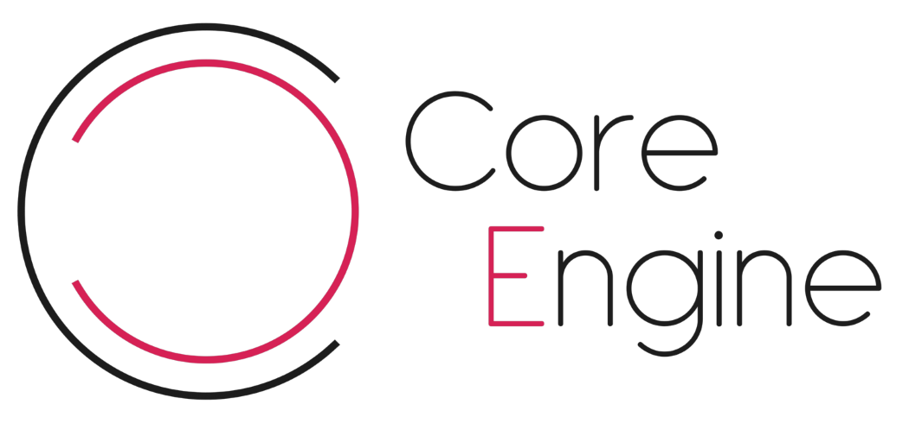

Website: TBA

<b>Wiki: [Click here](https://github.com/Pitj3/Core-CS/wiki)</b>

Email: roderick.griffioen@gmail.com

| **Platform** | **32 Bit** | **64 Bit** |
|---|---|---|
|**Windows**         | | |

# Core Engine
#### Why Core Engine?

The Core Engine is a powerful cross platform. Written in C# it delivers great performance and great quality.
The engine is currently in very early baby stage. The community can pitch in and support me in building this engine (I am a one man dev team).
I stream making parts of this engine on twitch where you can join in and have some chats or see how I go about making this engine.

<b>The changelog can be found at the bottom of this page.</b>

---

#### Core Tech
When the engine is finished it will be/contain:

- Consistent 2D/3D API available in C#
- Completely open source and community fed.
- High performance engine core written in C#.
- 2D and 3D physics available through Box2D and PhysX.
- High quality sound engine.
- Highly functional editor to create maps and edit resources.
- Tools to create AI, Animation setups, scripts etc.
- Visual code editor.
- Visual material editor.
- Core Engine Shading Language (CESL) for writing cross platform shaders.
- And much more, expect this list to grow over time!

---

#### Core Engine Roadmap
Do you want to know what is planned in the future for the Core Engine?
[Trello Roadmap](https://trello.com/b/OCBe57G3/core-engine-roadmap)

---

#### Looking For:
I'm looking for people that like to help out with this engine, if you can spare some time to check/write code, implement data structures, design architectures or help me think about design and future additions please write me a line!

<b>Right now I need the most:</b>
- DirectX dev has been abandoned for the reason of it not being really needed. OpenGL is cross platform as is. (Also my skills in DirectX were lacking too much which slowed the development down loads)
- Artist to help create art for the editor and possibly website.
- Code Architecture designer to help properly structure the engine.
- Proficient Winforms programmer / designer to help me make the editor even better.
- You! I need anyone who wants to help out and make this a great engine, if you feel like you can offer something great to this engine, write me a line!

---

#### Isn't this engine also being made in C++?
It was, C# has proven itself to be more suited for the way I want to make this engine. The old C++ source will stay available, but is discontinued. 

---

#### Documentation

Coming back online soon!

---

# Changelog
3-6-17
- Refactored saving and loading code, files are now saved in their own format (.casset) and loaded properly
- Refactored some rendering code
- Made interface for renderer
- Made the basic architecture for deferred rendering
- Added Light interface with directional light (currently functions as a point light)
- Cleaned up code and documented undocumented functions

3-5-17
- Added editor to project
- Editor can now edit objects properties
- Editor can create new object and add components
- Editor can load and save with dialogs
- New Project Launcher, can create projects. Syncs all current engine files and makes an empty project.
- StaticModel class, loads all materials and textures recursively, support for many different model types

3-2-17
- Wiki now contains sample code!
- Components working properly now, they are saved as they should, including the resources they might use
- Check the latest commit message to see the latest changes, screenshots and blog about the progress are in the makings!

---

## Special thanks to:

<b>Konstantinos Mourelas for making the sweet looking logo!</b>
